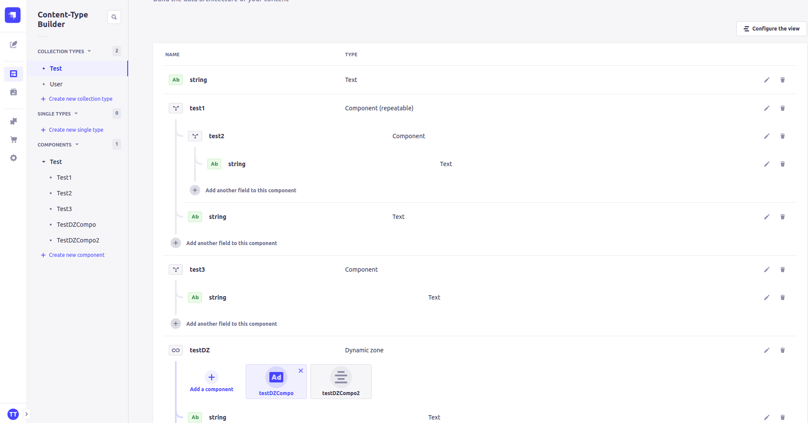
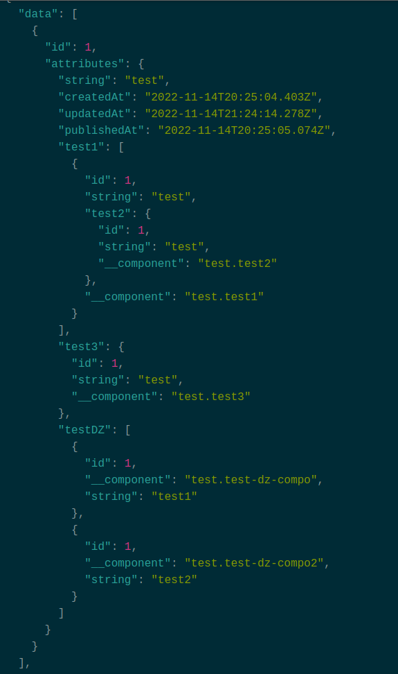
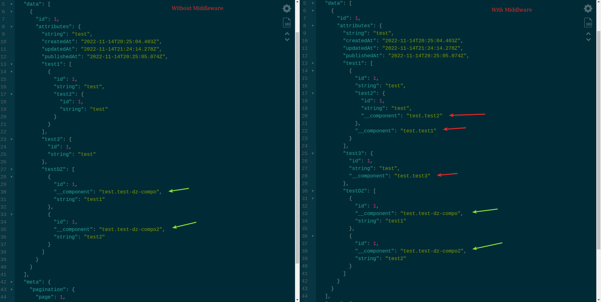

# Injecting Component Types

This is an example middleware that injects component types into the response body for components outside of a Dynamic Zone.

The logic shown here is not perfect and is only meant to be an example. It is not meant to be used in production. This logic covers the following cases:

- A "top level" component
- A "second level" component
- (by nature) A "top level" component within a Dynamic Zone

What is not covered:

- Components more than 2 levels deep
- 2nd level components within a Dynamic Zone

## Example Model structure

The following structure was designed to cover most use-cases of components up to a second level of depth. A dynamic zone is included to show how the logic would work if a component was nested within a dynamic zone, which is what this middleware is trying to replicate.

## Example Response

As you can see in this example response the `__component` property is injected into the response body for components that are not within a Dynamic Zone. This is done by checking the schema of the content-types and looking for component fields to inject the `__component` property into. Likewise it will look another layer deeper within the component and check for a nested one to also inject the `__component` property into.

## Response differences with and without middleware

The [middleware logic](src/middlewares/typeNameInjector.js) is very simple and can be used as a starting point for your own middleware. It is not meant to be used in production as it is not perfect and does not cover all use-cases.

## Forward

Ideally this example should be expanded on and cleaned up as it's really not optimized, in certain cases this could be a very expensive operation. It's also not very flexible as it's hard coded to only look for 2 levels of components. Ideally this would be configurable and would be able to handle any number of levels of components.

It would generally be considered a better practice to hard code component mapping in your frontend application instead of relying on the `__component` or `__typeName` for non-dynamic zone components, but the goal here is to show what is possible.
